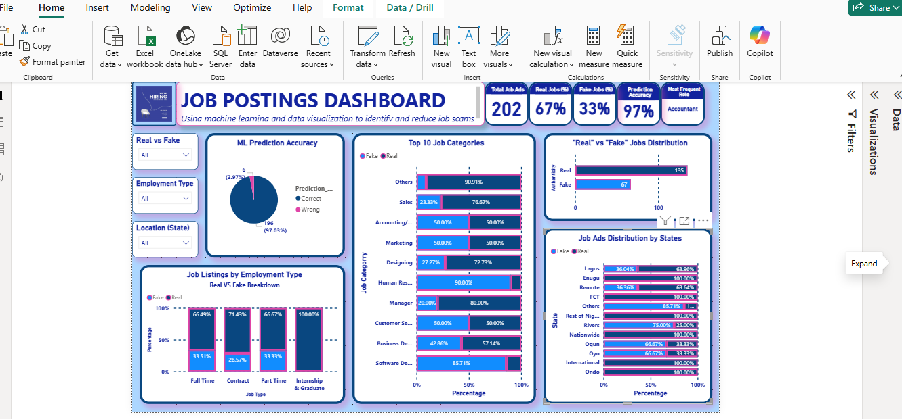

# 🧠 Job Scam Detection Using Machine Learning & Power BI

This project was developed as part of the **3MTT Knowledge Showcase**. It tackles the growing concern of **fake job postings** by combining **machine learning** with **data visualization** to help identify and reduce job scams in Nigeria's labor market.

The project involves:
- Cleaning and analyzing real-world job listing data
- Building a machine learning model to predict scam likelihood
- Designing a Power BI dashboard to visualize patterns and risks
- Creating a Streamlit app for real-time scam prediction

---

## 📊 Dashboard Summary


The Power BI dashboard features:
- Real vs Fake Job Distribution
- Most Common Job Titles
- Job Scam Trends by Category, Location, and Employment Type
- ML Prediction Accuracy
- Interactive slicers and filters



---

## 🛠️ Tools & Technologies

- **Python** (Pandas, Scikit-learn, Joblib)
- **Streamlit** – for the AI web app
- **Power BI** – for visual storytelling
- **Jupyter Notebook** – for model training
- **Power Query** – for data transformation
- **GitHub** – for version control and sharing

---

## 🧪 Machine Learning Model

- **Type:** Logistic Regression  
- **Accuracy:** 97%  
- **Features Used:** Job title, description, requirements, company info, salary, location, etc.

The model was trained using a cleaned dataset of 202 Nigerian job postings, labeled as either **real (0)** or **fake (1)**.

---

## 🚀 How to Use This Project

### 🔹 Clone the Repository
```bash
git clone https://github.com/theaderemifelix/job-scam-detector.git
cd job-scam-detector
```

### 🔹 Install Requirements
```bash
pip install -r requirements.txt
```

### 🔹 Run the Streamlit App
```bash
streamlit run streamlit_app.py
```

---

## 📁 Project Structure

```plaintext
├── job listings cleaned.csv         # Cleaned dataset
├── job_model.pkl                    # Trained ML model
├── vectorizer.pkl                   # Text transformer
├── streamlit_app.py                 # Web app script
├── Notebook.ipynb                   # Model training notebook
├── PowerBI_Screenshot.png           # Dashboard snapshot
├── Job_Postings_Dashboard_Report.docx # Project report
├── README.md                        # This file
```

---

## 📌 Recommendations

- Job seekers should be cautious with **remote**, **contract**, and **sales** roles
- Employers and job boards can integrate simple AI models for fraud detection
- Policy makers should drive awareness of scam job trends across categories

---

## 🙌 Acknowledgements

- **@3mttnigeria** @nitdanigeria – for organizing the learning journey  
- **@ayanfeolabamiji** – my instructor  
- Special thanks to @danielumoren and the 3MTT community team  
- Project inspired by real labor market concerns in Nigeria

---

## 📣 Let’s Connect

I'm open to **feedback, collaborations, or opportunities** in data analysis, machine learning, or public-interest tech.

📧 Email: theaderemifelix@gmail.com 
🔗 LinkedIn: linkedin.com/in/theaderemifelix
